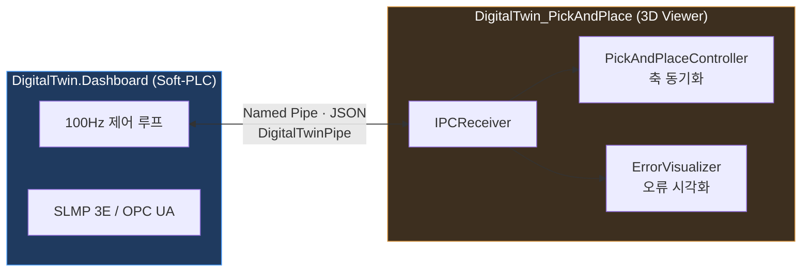
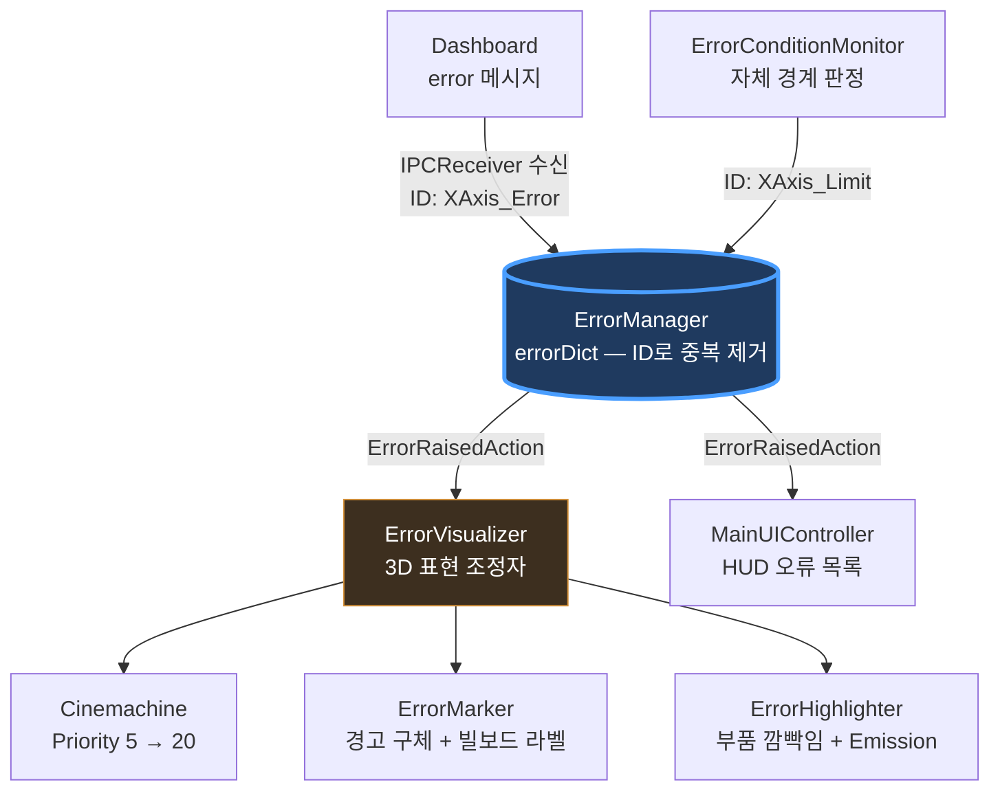

# DigitalTwin_PickAndPlace

픽앤플레이스 장비의 3D 디지털 트윈 뷰어입니다. Named Pipe로 [DigitalTwin.Dashboard](https://github.com/udune/DigitalTwin.Dashboard)(Soft-PLC)에 붙어서 3축 위치를 실시간으로 따라가고, 오류가 나면 카메라가 알아서 그 부위를 잡아줍니다.

원격지에서 화면만 보고도 "어느 축에서 무슨 일이 났는지" 바로 알 수 있게 하는 게 목표였습니다.

Dashboard(WPF) 쪽이 100Hz 제어 루프를 돌리면서 SLMP 3E / OPC UA로 값을 내보내는 두뇌 역할이고, 이 저장소의 Unity는 그걸 그려주는 눈 역할입니다. 둘 사이는 `DigitalTwinPipe`라는 이름의 파이프 하나로 줄 단위 JSON을 주고받습니다.



## 오류 시각화

가장 공들인 부분입니다. 오류 하나가 들어오면 네 가지가 동시에 일어납니다.

먼저 오류 카메라의 Cinemachine Priority를 5에서 20으로 올려 메인 카메라를 밀어냅니다. 카메라 위치는 고정값이 아니라 해당 축 Transform에 오프셋을 더해 매 프레임 계산하므로, 축이 움직이는 중에도 계속 따라붙습니다.

오류 지점 위에는 경고 구체가 뜹니다. `RotateAndPulse`로 스케일 펄스를 주고, 라벨은 `BillBoard`로 항상 카메라를 보게 했습니다. 마커는 축마다 하나씩 미리 만들어 두고 켜고 끄기만 하기 때문에 런타임 할당이 없습니다.

부품 강조는 `MaterialPropertyBlock`으로 처리했습니다. 머티리얼을 교체하지 않으니 해제할 때 완전히 원복됩니다. 여기서 한 가지 걸렸던 게, 축이 X ⊃ Y ⊃ Z로 중첩돼 있어서 X축을 그냥 빨갛게 만들면 하위 축까지 전부 딸려 빨개진다는 점이었습니다. 그래서 하위 축 렌더러는 명시적으로 제외합니다. 머티리얼에 Emission이 켜져 있으면 발광까지 같이 적용됩니다.

오류가 풀리면 메인 카메라로 알아서 돌아옵니다. 동시에 여러 개가 떠 있으면 `Error`가 `Warning`보다 우선이라 심각한 쪽을 먼저 비춥니다.

## HUD

uGUI로 시작했다가 UI Toolkit(UXML/USS)으로 갈아엎었습니다. `MainUIController`가 `UIDocument`에서 루트만 받아서 세 개의 서브 컨트롤러에 넘기는 구조입니다.

- `StatusBarController` — 상단 상태 바. 에러/경고 유무에 따라 색과 문구가 바뀝니다.
- `ErrorPanelController` — 오류 목록, 템플릿 인스턴싱, 해제 표시, 이력 삭제
- `ConnectionStatusController` — 연결 인디케이터, 연결 중 점멸, 수동 재접속 버튼

UXML 5종(`MainUI`, `StatusBar`, `ErrorPanel`, `ErrorItem`, `ConnectionStatus`)과 USS 4종으로 되어 있습니다. 상태는 인라인 스타일 대신 클래스 이름을 붙였다 뗐다 하는 식으로 USS에 전달합니다.

## 그리퍼

`GripperController`는 진공 흡착과 집게 방식을 둘 다 지원합니다. `gripPoint`를 중심으로 `Physics.OverlapSphere`를 던져 `Pickable` 레이어에서 가장 가까운 물체를 고르고, 레이어가 없으면 `PickableObject` 컴포넌트를 전수 검색하는 폴백으로 넘어갑니다. Pick 하면 `Rigidbody.isKinematic`을 켜고 그리퍼에 붙이고, Place 하면 물리를 복원합니다. 집게 개폐는 `Lerp` 보간이고, 흡착 범위는 `OnDrawGizmosSelected`로 볼 수 있게 해뒀습니다.

## 통신

파이프 클라이언트는 백그라운드 스레드에서 돌기 때문에 수신 콜백을 그대로 실행하면 Unity API를 건드리는 순간 터집니다. 그래서 전부 `UnityMainThreadDispatcher`를 거쳐 메인 스레드로 마샬링합니다.

재연결 간격은 3초, 최대 재시도는 0(무제한), 연결 상태 확인은 0.5초 주기입니다. 상태는 `Disconnected / Connecting / Connected` 3단계로 UI에 그대로 반영되고, 수동 `Reconnect()`도 있습니다.

받는 메시지:

| 타입 | 내용 |
|---|---|
| `axis_data` | 위치 X/Y/Z, 속도 X/Y/Z, 타임스탬프 |
| `error` | code, source, errorType, message, timestamp |
| `error_clear` | code — 조건이 해소된 오류 1건 해제 |
| `clear_all_errors` | 알람 일괄 해제 |
| `gripper_command` | `pick` 또는 `place` |

보내는 메시지는 두 개뿐입니다. `axis_data`(키보드 조작 결과 위치)와 `gripper_status`(`isGripping`, 잡고 있는 물체 이름).

단위는 **1 Unity unit = 100mm**. 축 이름이 Unity 축과 안 맞으니 주의가 필요합니다. X는 x 그대로지만 Y는 z(전후), Z는 y(상하)로 갑니다.

## 조작

| 키 | 동작 |
|---|---|
| `←` `→` | X축 이동 |
| `↑` `↓` | Y축 이동 |
| `W` `S` | Z축 이동 |
| `G` | 그리퍼 Pick |
| `R` | 그리퍼 Place |
| `Space` | 원점 복귀 + 오류 전체 해제 |

기본 이동 속도는 100mm/s. 조작 결과는 바로 Dashboard로 넘어가 Soft-PLC의 타겟 위치가 됩니다.

## 오류 판정은 Dashboard가 한다

한동안 같은 오류가 두 줄로 뜨는 문제로 고생했는데, 원인은 Unity와 Dashboard가 각자 판정을 하고 있었기 때문이었습니다. 지금은 **판정 기준을 Dashboard 하나로 못박았고**, Unity는 받은 걸 표시만 합니다.

Dashboard가 `error`로 보내는 `code`(`X_LIMIT`, `Z_SAFE_HEIGHT`, `X_OVERSPEED` 등)가 그대로 `ErrorInfo.Id`가 됩니다. 같은 코드가 다시 오면 새로 쌓이는 게 아니라 제자리에서 갱신됩니다. 조건이 풀리면 Dashboard가 `error_clear`로 같은 코드를 지목하고 그 하나만 사라집니다. 모르는 `source`/`errorType`이거나 `code`가 없는 메시지는 경고 로그만 남기고 버립니다 — 예전에 임의의 기본값으로 삼켰더니 엉뚱한 축에 오류가 붙었습니다.

`ErrorConditionMonitor`의 로컬 판정은 Dashboard 없이 단독 실행할 때만 동작합니다. IPC가 연결되는 순간 자기가 올렸던 오류를 거두고 판정을 멈추고, 연결이 끊기면 이제 갱신되지 않는 Dashboard 오류를 전부 지운 뒤 다시 시작합니다.

단독 실행 시 판정 기준은 축별 min/max를 인스펙터에서 설정하는 방식입니다(Unity unit 기준). 범위를 벗어나면 `Error`, 바깥 15% 구간에 들어가면 `Warning`(`warningThreshold` 0.85)이고 우선순위는 Error > Warning > Normal입니다.

`disableWhenDashboardConnected`를 끄면 로컬 판정을 강제로 켜 둘 수 있긴 한데, 그러면 위에 적은 중복 문제가 그대로 돌아옵니다.



## 3D 모델

Blender Python 스크립트로 절차적으로 생성한 뒤 FBX로 내보냈습니다.

```
PickAndPlaceMachine
├── Frame / Control_Box / Y_Rail
└── X_Rail → X_Carriage → Bridge
              └── Z_AXIS
                    ├── Z_Motor / Z_Mount / Z_Guide_Rail
                    └── Gripper_Left / Gripper_Right
                          └── GripperPoint   ← 물체 부착 지점
```

부모-자식으로 축을 쌓아 올려서 상위 축이 움직이면 하위 축은 그냥 따라오게 했습니다. 머티리얼은 알루미늄, 플라스틱, 금속 3종.

## 실행

```bash
git clone https://github.com/udune/DigitalTwin_PickAndPlace.git
```

Unity Hub에서 **6000.4.2f1**로 열고 `Assets/Scenes/Main.unity`를 재생하면 됩니다. URP 17.4.0, Cinemachine 3.1.6, UI Toolkit, TextMeshPro를 씁니다.

Dashboard와 같이 돌릴 거면 WPF 앱을 먼저 켜고 `▶ START`를 누른 다음 Unity를 재생하세요. 순서가 반대여도 3초마다 재연결을 시도해서 결국 붙긴 합니다. Dashboard 없이 혼자 띄워도 키보드 조작과 로컬 오류 판정은 그대로 동작합니다.

## 구조

```
Assets/
├── Scripts/
│   ├── IPCReceiver.cs              Named Pipe 클라이언트 + 프로토콜
│   ├── PickAndPlaceController.cs   축 Transform 보간
│   ├── AxisMover.cs                키보드 입력
│   ├── ErrorVisualizer.cs          오류 시각화 조정자 (카메라 + 마커 + 부품 강조)
│   ├── BillBoard.cs / RotateAndPulse.cs
│   ├── UnityMainThreadDispatcher.cs
│   ├── Core/GripperController.cs
│   ├── Interaction/PickableObject.cs
│   ├── Error/                      ErrorManager, ErrorConditionMonitor, ErrorData
│   │                               ErrorMarker(경고 구체+라벨), ErrorHighlighter(부품 깜빡임)
│   └── UI/MainUIController.cs      + 3개 서브 컨트롤러
├── UI/
│   ├── Documents/                  UXML 5종
│   └── Styles/                     USS 4종
├── Prefabs/
└── Scenes/Main.unity
```

`.claude/skills/`에 프로젝트 전용 Claude Code 스킬 두 개를 넣어뒀습니다. `editor_check`는 Hierarchy/Inspector 설정이 C# 코드의 의도와 맞는지 검사합니다. Unity는 인스펙터 참조가 빠져도 컴파일은 멀쩡히 되고 런타임에 가서야 터지기 때문에 미리 걸러보려고 만들었습니다. `simplify`는 KISS 원칙 기반 리팩토링 보조용입니다.

## 아직 안 된 것들

- 그리퍼 Pick/Place는 Unity 키보드로만 됩니다. `gripper_command` 수신 로직은 있는데 Dashboard 쪽 송신 UI가 아직 없습니다.
- `ErrorConditionMonitor`의 경계값은 Unity unit이고 Dashboard 알람 경계는 mm라 값이 서로 다릅니다. 단독 실행 전용이라 연결 중에는 안 쓰이지만, 두 값이 서로를 따라가지는 않습니다.
- Input System 패키지는 깔려 있는데 입력은 레거시 `Input` 클래스를 씁니다.
- `PickAndPlaceController`가 `Lerp` 보간을 하다 보니 화면 위치가 실제 PLC 위치보다 살짝 늦습니다. 이건 의도한 시각적 스무딩입니다.

## 로드맵

- [x] 오류 판정 기준 Dashboard 단일화
- [ ] OpenCVSharp 연동 — 특정 형상 물체만 선별 픽업
- [ ] 자동 픽앤플레이스 사이클
- [ ] WebGL 빌드 배포

## 연관 리포지토리

[DigitalTwin.Dashboard](https://github.com/udune/DigitalTwin.Dashboard) — Soft-PLC 및 감시 대시보드 (WPF, SLMP 3E, OPC UA)
